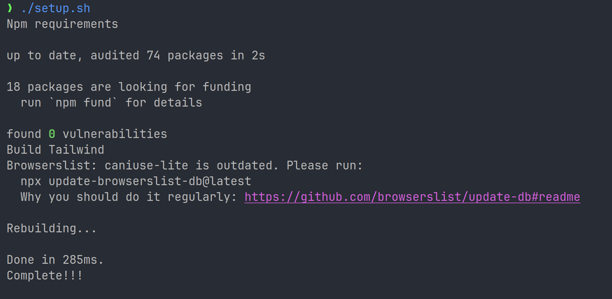

## Описание

---
Микросервис для верификации учебных планов на наличие компонентов образовательных программ.
Основная цель заключается в автоматизации проверки учебных планов 
Монолитная архитекрура, но при этом она встрается в сервис.
пример ссылки: https://mauniver.ru/sveden/education/op/43292#prak

## Подготовительный этап
1. На сервере должен быть установлен `docker` и `docker compose`
2. Также необходим пакет `npm` для сборки tailwind


## Запуск

---
#### 1. создайте .env файл со своими настройками
```
cd backend
cp .env.example .env
```
И укажите ваши чувствительные данные

#### 2. соберите tailwind
```
cd web 
chmod +x setup.sh
./setup.sh
```
В логах должно отобразиться `Complete!!!`


#### 3. запустите compose сборку (из корня проекта)
```
docker compose -f docker-compose.prod.yml up --build --remove-orphans
```